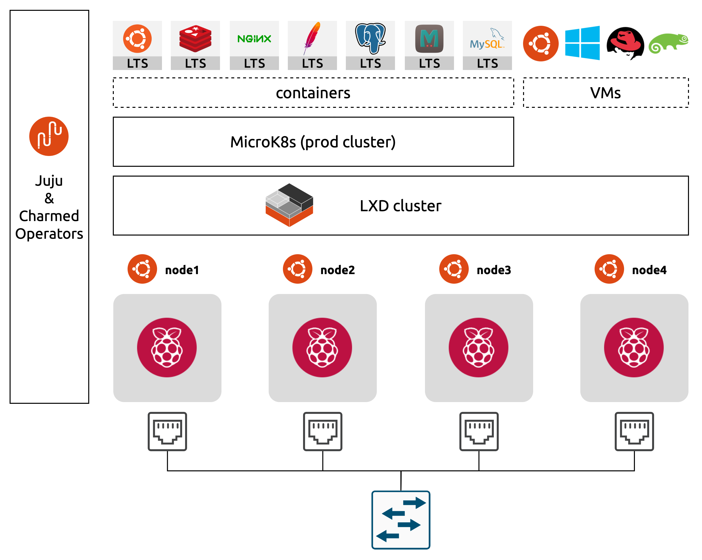
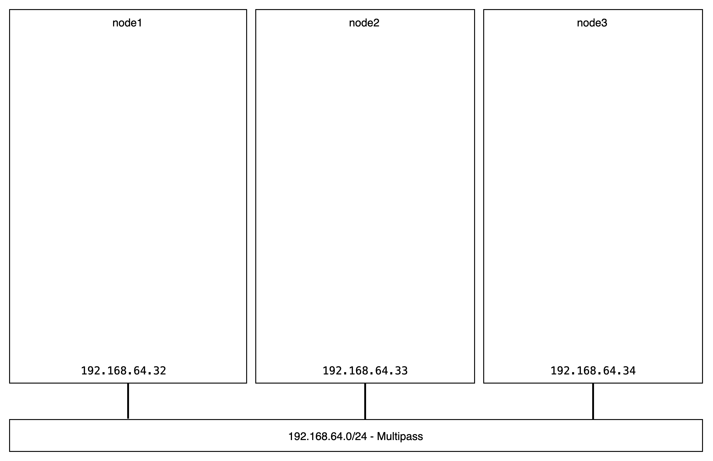
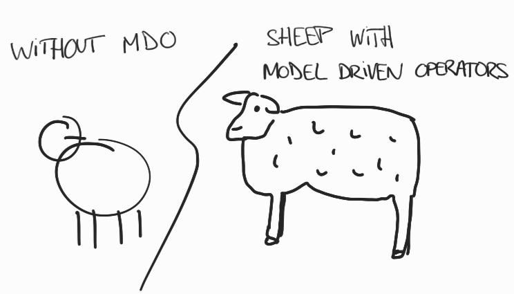

# Arm, Ubuntu, K8s: Build Your Own Cloud for Edge Computing

**Have you dreamt of having your own home cloud but found it too complex?     
Micro clouds enable anyone to build a lightweight cloud anywhere.**

## Abstract

Building micro clouds or edge clouds has vast potential.
The edge is where the real world happens.
Edge clusters bring your technologies to the consumer for more privacy and less latency.
So, where to begin? With Arm, duh, but what about after that?

This workshop gets you started.
For beginners, from install, set-up and config of an Ubuntu K8s cluster.
And experts, talking DevOps, AI use cases, and inferences at the edge, on something as simple and accessible as a Raspberry Pi or a Jetson Nano.

Table of Contents
=================

   * [Abstract](#abstract)
   * [Minimum Configuration](#minimum-configuration)
   * [Building Your Home Lab Micro Cloud in 5 Steps](#building-your-home-lab-micro-cloud-in-5-steps)
      * [#1 Prepare the bare metal nodes](#1-prepare-the-bare-metal-nodes)
      * [#2 Cluster the machines with LXD: your first cloud!](#2-cluster-the-machines-with-lxd-your-first-cloud)
      * [#3 Register your cloud for model-driven operations](#3-register-your-cloud-for-model-driven-operations)
      * [#4 Create on-demand MicroK8s clusters: a micro cloud dream](#4-create-on-demand-microk8s-clusters-a-micro-cloud-dream)
      * [#5 Run cloud-native applications at the edge with micro clouds](#5-run-cloud-native-applications-at-the-edge-with-micro-clouds)
         * [Register your MicroK8s edge clusters with Portainer](#register-your-microk8s-edge-clusters-with-portainer)
         * [Register your MicroK8s edge clusters with Juju](#register-your-microk8s-edge-clusters-with-juju)
         * [Deploy applications to your micro cloud with Juju and Charms](#deploy-applications-to-your-micro-cloud-with-juju-and-charms)
   * [Authors/Reviewers](#authorsreviewers)

<!-- ToDo: Section about "what are micro clouds" / Goals -->


## Minimum Configuration

> To enable the most to follow this tutorial at home, we won't require any specific hardware - only your workstation will do it.
> Nonetheless, you will find secondary paths and alternative options all along, including instructions to use a cluster of Raspberry Pis.
> The following requirements apply if you're willing to follow the primary path, using virtualisation to emulate multiple small devices.

- 16GB RAM recommended (8GB min required);
- Min 50GB of storage left;
- [Multipass installed](https://multipass.run/) for your platform.

Before attending, please make sure you can use [Multipass](https://multipass.run/). The following commands should run without any specific configuration:

<!-- <details>
    <summary>
Click to expand the instructions.
    </summary> -->

```sh
    $ multipass launch --name iamatest --mem 8G --disk 10G
    Launched: iamatest 

    $ multipass list
    Name                    State             IPv4             Image
    iamatest                Running           192.168.64.71    Ubuntu 20.04 LTS

    $ multipass exec iamatest -- sudo snap install microk8s --classic
    microk8s (1.21/stable) v1.21.3 from Canonical✓ installed

    $ multipass exec iamatest -- sudo microk8s status --wait-ready
    microk8s is running
    high-availability: no
    datastore master nodes: 127.0.0.1:19001
    datastore standby nodes: none
    ...

    $ multipass stop iamatest
    $ multipass delete iamatest
    $ multipass list
    Name                    State             IPv4             Image
    iamatest                Deleted           --               Not Available

    $ multipass purge
```

> The sequence above should not take more than 10mn to run.
> Otherwise, please consider stopping any greedy processes, using a more powerful machine or a cloud-based virtual machine.

<!-- ToDo: test on a cloud virtual machine, and link to a tutorial. -->

<!-- </details> -->


## Building Your Home Lab Micro Cloud in 5 Steps



<!-- 

Options: 
- Virtual machines or Physical devices (RPis)
- Juju or not Juju
- Application 

 -->

To make it easier to follow, we split this tutorial into five steps with clear goals.
At the end of each step, a checkpoint will help you understand what is the outcome.
If you can't get to the checkpoint, please reach out for help to the staff or [online forums](https://discourse.ubuntu.com/). You are also welcome to [open issues](https://github.com/valentincanonical/diy-microcloud/issues) directly on this repository.

> **Checkpoint #0: [Minimum requirements matched.](#minimum-configuration)**    


### #1 Prepare the bare metal nodes

_Expected duration: 5mn_

<!-- ToDo: refactor the big blocks of text -->

> In a usual micro cloud setup, this step - bare metal provisioning - would be fully automated. [Metal as a Service (MAAS)](https://maas.io/) can provision several to hundreds of physical servers and micro clouds spread over various locations. MAAS provides a way to flexibly deploy, manage, and maintain operating system loads on physical servers. It keeps track of all servers and their configurations available in the micro cloud. It is the base layer of the micro cloud stack.

> In this virtual and one-site configuration, we won't be using MAAS. As micro clouds are fully modular, this will allow us to focus on the virtualisation and K8s layers. I invite you to [read more about MAAS](https://maas.io/tutorials) to automate your bare metal provisioning in further micro cloud deployments!

This first step guides you through the provisioning of four Ubuntu machines using Multipass. The four virtual machines will emulate four physical nodes - let them be Raspberry Pis or any other small edge hardware.

```sh
# Let's use bash to loop over the creation of four Ubuntu machines using Multipass
$ for i in {1..4}; do multipass launch --name node$i --mem 4G --disk 10G; done;
Launched: node1                                                                 
Launched: node2                                                                 
Launched: node3                                                                 
Launched: node4

$ multipass list
Name                    State             IPv4             Image
node1                   Running           192.168.64.32    Ubuntu 20.04 LTS
node2                   Running           192.168.64.33    Ubuntu 20.04 LTS
node3                   Running           192.168.64.34    Ubuntu 20.04 LTS
node4                   Running           192.168.64.35    Ubuntu 20.04 LTS

$ multipass shell node1
ubuntu@node1:~$ # That's it! We now have four Ubuntu identical machines ready-to-go
```

If you are using Raspberry Pis instead, you can [follow this tutorial to install the latest Ubuntu Server](https://ubuntu.com/tutorials/how-to-install-ubuntu-on-your-raspberry-pi#1-overview). I recommend using RPi 4+ 8GB, or above. (For stable deployments, I recommend you consider [the USB boot option](https://ubuntu.com/tutorials/how-to-install-ubuntu-desktop-on-raspberry-pi-4#4-optional-usb-boot) from an SSD instead of the SD card - from Ubuntu 20.10.)

> **Checkpoint #1: Four Ubuntu machines on the same network.**



### #2 Cluster the machines with LXD: your first cloud!

_Expected duration: 15mn_

This section is the moment we get to build our first cloud capabilities. We will cluster the four physical machines together, abstracting them as a virtual layer capable of providing both Linux containers and virtual machines.
We will then have virtual machines from almost any Linux distribution available no more than one command away. (If you're a more advanced user, [read more on how to get Windows VMs](https://github.com/lxc/distrobuilder#repack-windows-iso).)

<!-- ToDo: Add option with the LXD charm and Juju -->

Abstracting away from the bare metal layer is a practical step to building automated, scalable, and modular micro clouds. You may wonder why we don't just go directly with the K8s layer - and you could do it -, so here's what you get with the additional LXD virtualisation layer:

- Increased security: machine containers provide better protection than K8s containers to keep your workloads confined;
- Multi-tenancy: in some situations, you might need more than one K8s cluster on the same micro cloud - don't shut any door now;
- Flexibility: adding and removing physical nodes has never been easier - with LXD, you can [move containers/virtual machines](https://linuxcontainers.org/lxc/manpages/man1/lxc-copy.1.html) between physical nodes;
- High availability: LXD adds a layer of resiliency to failures and outages with built-in high availability from 3 nodes and above;
- Simplified operations: the more you can abstract, the more you will standardise and automate remote management operations.

<!-- ToDo: Options 1 & 2, with and without automation - once LXD charm is ready -->

[Tutorial Step 2: Instructions to build your edge cloud using LXD.](./step02-lxd-cloud/README.md#initiate-the-first-node)

> **Checkpoint #2: Four-node LXD cluster ready to operate.**

```sh
ubuntu@node4:~$ lxc cluster list
+-------+----------------------------+----------+--------+-------------------+--------------+
| NAME  |            URL             | DATABASE | STATE  |      MESSAGE      | ARCHITECTURE |
+-------+----------------------------+----------+--------+-------------------+--------------+
| node1 | https://192.168.64.32:8443 | YES      | ONLINE | Fully operational | x86_64       |
+-------+----------------------------+----------+--------+-------------------+--------------+
| node2 | https://192.168.64.33:8443 | YES      | ONLINE | Fully operational | x86_64       |
+-------+----------------------------+----------+--------+-------------------+--------------+
| node3 | https://192.168.64.34:8443 | YES      | ONLINE | Fully operational | x86_64       |
+-------+----------------------------+----------+--------+-------------------+--------------+
| node4 | https://192.168.64.35:8443 | YES      | ONLINE | Fully operational | x86_64       |
+-------+----------------------------+----------+--------+-------------------+--------------+
```


<!-- ToDo: Might need to move section 3 before 2, and use Juju to bootstrap LXD cluster -->
### #3 Register your cloud for model-driven operations

_Expected duration: 8mn_

"[Model-Driven Operations](https://juju.is/model-driven-operations-manifesto), say what?" The concept is relatively easy yet extremely powerful. Imagine we were discussing over the phone, and you suddenly wanted me to draw you a sheep; you would have two options:
- Guide me, step by step, trying to be as specific as possible - "draw four small vertical lines, now draw a circle on top..."
- Or rely on my knowledge of concepts and simply ask, "can you draw me a sheep, please."

I promise you; the first option won't give you anything even close to a sheep... and it will take us _a lot of time_.



(Ok, I'm not good at drawings... but still better when relying on shared concepts! :) )

Now imagine I am a server, and there are thousands of us with slightly different configurations (different cloud, platform, architecture...). Wouldn't it be great if you could just teach me what a database is? And teach me how it relates to other applications to provide persistent storage? That's Model Driven Operations!    
With Charmed Operators, you can package concepts and operational knowledge. With Juju, you can apply this knowledge with declarative queries, politely asking for what you need. "Please Juju, deploy this and that. Also, please Juju relate this with that." And that's it; you have a web server deployed on multiple clouds with a database properly configured and related to your web application! If you're interested, there's a lot of exciting and fun reads [on Juju.is](https://juju.is/blog).

<!-- ToDo: Add link to the Edge MDO blog entry on Ubuntu.com (TBD) -->
<!-- ToDo: Add link to the Kubecon blogs (TBD) -->

> You can decide to skip this step and [jump to the next section](#manually-deploy-a-microk8s-cluster) if you're going for the manual installation instead of using Juju and Charmed Operators.

[Tutorial Step 3: Instructions to install Juju and register your LXD micro cloud.](./step03-juju-bootstrap/README.md#install-juju).

> **Checkpoint #3: LXD cloud can be controlled remotely.**

```
ubuntu@node1:~$ juju status
Model    Controller          Cloud/Region        Version  SLA          Timestamp
default  microcloud-default  microcloud/default  2.9.12   unsupported  13:05:13+02:00

Model "admin/default" is empty.
```


### #4 Create on-demand MicroK8s clusters: a micro cloud dream

<!-- 19h10 -->
_Expected Duration: 20mn_

<!-- MicroK8s is a low-ops, minimal production Kubernetes, for devs, cloud, clusters, workstations, Edge and IoT.    
In a micro cloud architecture, Kubernetes APIs make management of edge clusters easier to integrate with existing infrastructure and centralised control planes. MicroK8s is lightweight and yet features the K8s APIs, none added or removed. MicroK8s ships with with sensible defaults that ‘just work’. And from 3 nodes, MicroK8s automatically supports an highly-available configuration.

#### Deploy on-demand kubernetes clusters with Juju

Currently, there is no MicroK8s charm on [CharmHub](https://charmhub.io/), the Store for Charmed Operators. However, there is a version contributed [by @pjdc](https://launchpad.net/~pjdc/+git/charm-microk8s) a community member on Launchpad. It's just a matter of time until we get an official one!

For this workshop, I forked pjdc's version and adapted it to work on top of LXD. We'll start by cloning my repository with the MicroK8s' Charmed Operator, a package with all the knowledge on how to deploy a MicroK8s cluster.

```sh
# Clone the modified Charmed Operator where you installed Juju at Step #3
ubuntu@node1:~$ git clone -b fix/lxd https://git.launchpad.net/~valentinviennot/+git/charm-microk8s
```

In order, we will:
- create a new model, a clean space to isolate our work;
- deploy four microk8s nodes with a simple juju command;
- sip a cocktail 🍹 while Juju does all the work for us (launch four LXD containers, install microk8s on each of them, and cluster them together).

```sh
ubuntu@node1:~$ juju models
Controller: microcloud-default
Model                Cloud/Region        Type  Status     Machines  Access  Last connection
controller           microcloud/default  lxd   available         1  admin   just now
default              microcloud/default  lxd   available         0  admin   8 minutes ago
kubernetes-is-easy*  microcloud/default  lxd   available         0  admin   28 seconds ago

ubuntu@node1:~$ juju add-model kubernetes-is-easy
ubuntu@node1:~$ juju switch kubernetes-is-easy
ubuntu@node1:~$ juju status
Model               Controller          Cloud/Region        Version  SLA          Timestamp
kubernetes-is-easy  microcloud-default  microcloud/default  2.9.14   unsupported  18:46:16+02:00

Model "admin/kubernetes-is-easy" is empty.

# We deploy the app 'microk8s' from the local charm with force option as we use an unvalidated LXD profile
ubuntu@node1:~$ juju deploy ./charm-microk8s microk8s -n3 --force

# We can watch operations as they happen with 'juju status'
ubuntu@node1:~$ watch -cn0.5 juju status --color
Model               Controller          Cloud/Region        Version  SLA          Timestamp
kubernetes-is-easy  microcloud-default  microcloud/default  2.9.14   unsupported  18:58:25+02:00

App       Version  Status   Scale  Charm     Store  Channel  Rev  OS      Message
microk8s           waiting    0/3  microk8s  local             0  ubuntu  waiting for machine

Unit        Workload  Agent       Machine  Public address  Ports  Message
microk8s/0  waiting   allocating  0        240.33.0.11            waiting for machine
microk8s/1  waiting   allocating  1                               waiting for machine
microk8s/2  waiting   allocating  2                               waiting for machine

Machine  State    DNS          Inst id        Series  AZ  Message
0        pending  240.33.0.11  juju-ab5f48-0  focal       Running
1        pending               pending        focal       Creating container
2        pending               pending        focal
```

#### Manually deploy a MicroK8s cluster

If you want to see what is happening under the hood, you can manually start LXD containers and set up MicroK8s. I would recommend using [the Juju option](#deploy-on-demand-kubernetes-clusters-with-juju) to save some time and uncover the power of Charmed Operators, but you're also good to go with this option. Installing MicroK8s is only the matter of one "snap install microk8s" command and a "microk8s add/join" per machine to cluster your nodes together. -->

[Tutorial Step 4 (bis): Instructions to manually create MicroK8s clusters.](./step04-microk8s-clusters/README.md#manual-installation)


> **Checkpoint #4: MicroK8s cluster on LXD, up and running.**

```sh
# ToDo: Paste status output with HA
```

### #5 Run cloud-native applications at the edge with micro clouds

Your micro cloud is now ready, registered, and you know how to create lightweight MicroK8s clusters on demand. The next steps are optional, feel free to pick what's the most interesting to you. The goal there is to get you productive with fancy applications running on your homelab micro cloud.

#### Register your MicroK8s edge clusters with Portainer

_Expected duration: Xmn_

#### Register your MicroK8s edge clusters with Juju

_Expected duration: Xmn_

#### Deploy applications to your micro cloud with Juju and Charms

_Expected duration: Xmn_

<!-- Bonus -->

> **Checkpoint #4: Application deployed on *production* MicroK8s.**

## Authors/Reviewers

- Valentin Viennot, Product Manager, Canonical (Twitter: [@ValentinViennot](https://twitter.com/valentinviennot))

<!-- ToDo: get relevant reviews from the different product teams involved. -->

<!-- ToDo: validate license terms -->

Table of Content generated with [gh-md-toc](https://github.com/ekalinin/github-markdown-toc).

---

 Copyright 2021 Valentin Viennot for Canonical Ltd.

   [Licensed under the Apache License](./LICENSE), Version 2.0 (the "License");
   you may not use this file except in compliance with the License.
   You may obtain a copy of the License at

       http://www.apache.org/licenses/LICENSE-2.0

   Unless required by applicable law or agreed to in writing, software
   distributed under the License is distributed on an "AS IS" BASIS,
   WITHOUT WARRANTIES OR CONDITIONS OF ANY KIND, either express or implied.
   See the License for the specific language governing permissions and
   limitations under the License.
